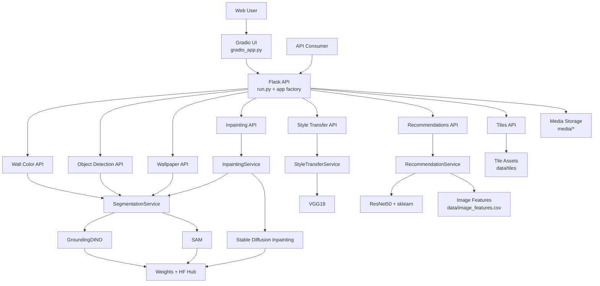
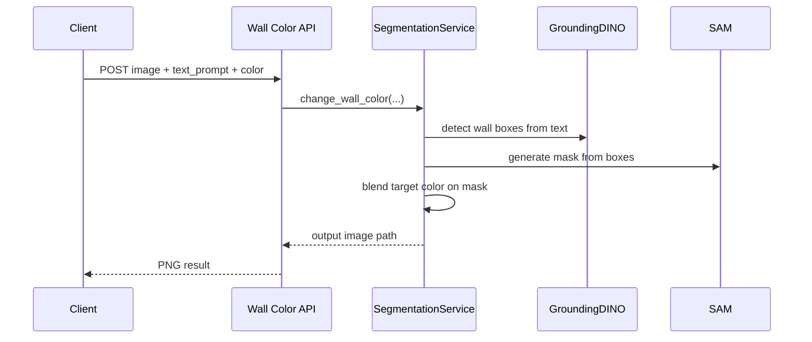
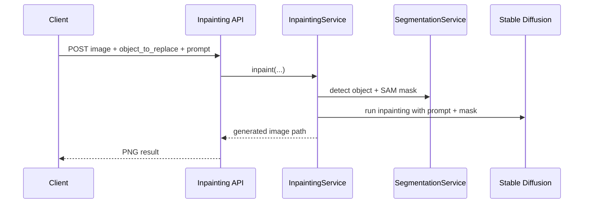
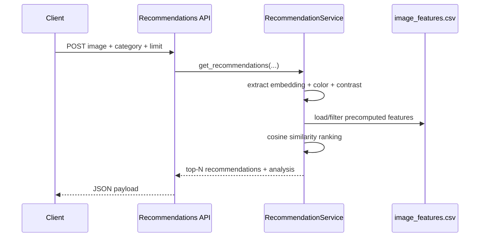
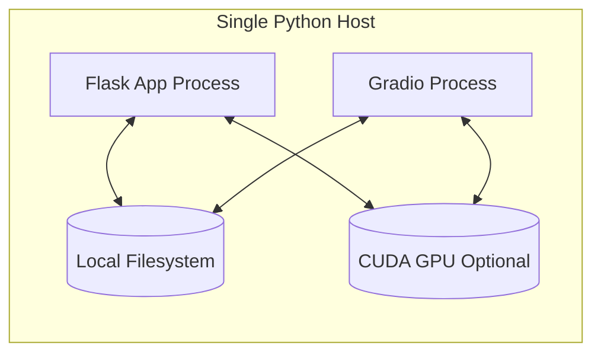

# AI Interior Design Studio Architecture

This document describes the production architecture of the project based on the current implementation in:
- `run.py`
- `gradio_app.py`
- `app/__init__.py`
- `app/api/*.py`
- `app/services/*.py`
- `app/utils/*.py`

## 1. System Context

## 2. Runtime Layers

1. Interface Layer
- `gradio_app.py` provides an interactive UI with lazy service loading.
- Flask endpoints provide REST interfaces for all capabilities.

2. API Layer (Flask Blueprints)
- `app/api/wall_color.py`
- `app/api/object_detection.py`
- `app/api/wallpaper.py`
- `app/api/inpainting.py`
- `app/api/style_transfer.py`
- `app/api/recommendations.py`
- `app/api/tiles.py`

3. Service Layer
- `SegmentationService`: wall/object detection, wall mask generation, wallpaper overlay.
- `InpaintingService`: object mask + diffusion inpainting.
- `StyleTransferService`: neural style transfer optimization loop.
- `RecommendationService`: embeddings, similarity search, image analysis.

4. Model Layer
- GroundingDINO for text-guided detection.
- SAM for segmentation masks.
- Stable Diffusion Inpainting for object replacement.
- VGG19 for style transfer.
- ResNet50 (TensorFlow) for recommendation embeddings.

5. Data/Storage Layer
- `media/` for request inputs and generated outputs.
- `weights/` and `MODEL_CACHE_DIR` for model artifacts.
- `data/tiles/` for wallpaper/tile gallery assets.
- `data/image_features.csv` for recommendation lookup.

## 3. Endpoint to Service Mapping

| Endpoint | Blueprint File | Service | Output |
|---|---|---|---|
| `POST /api/wall-color/change` | `app/api/wall_color.py` | `SegmentationService.change_wall_color` | PNG image |
| `GET /api/wall-color/colors` | `app/api/wall_color.py` | `Config.COLOR_MAP` | JSON |
| `POST /api/objects/detect` | `app/api/object_detection.py` | `SegmentationService.detect_objects` | JSON |
| `GET /api/objects/default-objects` | `app/api/object_detection.py` | `Config.DEFAULT_DETECTABLE_OBJECTS` | JSON |
| `POST /api/wallpaper/apply` | `app/api/wallpaper.py` | `SegmentationService.apply_wallpaper` | JPG image |
| `POST /api/inpaint/apply` | `app/api/inpainting.py` | `InpaintingService.inpaint` | PNG image |
| `POST /api/style-transfer/apply` | `app/api/style_transfer.py` | `StyleTransferService.transfer_style` | JPG image |
| `POST /api/recommendations/similar` | `app/api/recommendations.py` | `RecommendationService.get_recommendations` | JSON |
| `POST /api/recommendations/analyze` | `app/api/recommendations.py` | `RecommendationService.analyze_image` | JSON |
| `GET /api/recommendations/categories` | `app/api/recommendations.py` | Static categories | JSON |
| `GET /api/tiles/gallery` | `app/api/tiles.py` | Filesystem tile scan + base64 thumbnails | JSON |
| `GET /api/tiles/image/<filename>` | `app/api/tiles.py` | Filesystem direct image | Image |

## 4. Key Processing Flows

### 4.1 Wall Color Change

### 4.2 Object Replacement Inpainting

### 4.3 Recommendations

## 5. Deployment View (Current)

Notes:
- Flask and Gradio can run together in development; production should use a reverse proxy and separate process management.
- Model loading is mostly lazy/singleton in service classes, which reduces startup cost but increases first-request latency.

## 6. Architectural Strengths

- Clean separation between API endpoints and AI service logic.
- Reusable segmentation core across wall color, detection, wallpaper, and inpainting mask generation.
- Lazy model loading avoids loading all heavy models at boot.
- Utility layer centralizes file I/O and output path conventions.

## 7. Improvement Roadmap

1. Add an async job queue (Celery/RQ + Redis) for long-running inference tasks.
2. Move generated media to object storage (S3/Azure Blob) with signed URLs.
3. Add model warm-up endpoint and health checks per model.
4. Split TensorFlow recommendation service into optional microservice to reduce base memory footprint.
5. Add request tracing and per-endpoint latency metrics.
6. Add API auth/rate limiting (the README diagram mentions this, but it is not currently implemented in code).

## 8. GitHub Integration

Recommended repo links:
- In `README.md`, link this file under Architecture: `docs/ARCHITECTURE.md`.
- Keep Mermaid diagrams in Markdown so they render natively in GitHub without external images.
